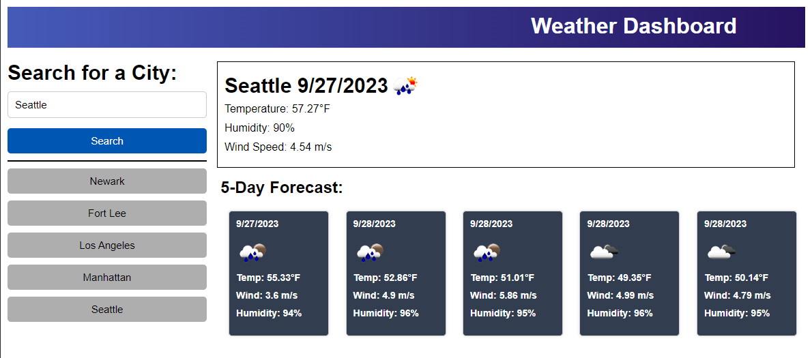

# weather_dashboard

## Description

The Weather Dashboard is a web application that allows users to retrieve and view current and future weather conditions for cities around the world. Users can search for a city, view detailed weather information, and access a 5-day weather forecast. Additionally, the application keeps a record of previous searches in the search history for easy access.

## Usage

1. Search for a City:
    - Enter the name of a city in the provided search input.
    - Click the "Search" button or press "Enter" to retrieve weather data.

2. View Current Weather:
    - After searching for a city, the current weather information is displayed on the dashboard.

3. View 5-Day Forecast:
    - Scroll down to see the 5-day weather forecast for the selected city.

4. Access Search History:
    - Previous city searches are listed in the search history section.
    - Click on a city in the search history to revisit its weather information.

## Assets
The following image demonstrates the web application's appearance and functionality:

## Link to GitHub Repository:

[https://github.com/ademonteverde/weather_dashboard](https://github.com/ademonteverde/weather_dashboard)

## Link to deployed application:

[https://ademonteverde.github.io/weather_dashboard/](https://ademonteverde.github.io/weather_dashboard/)

## License

This project is licensed under the [MIT](https://github.com/ademonteverde/weather_dashboard/blob/main/LICENSE) License.

